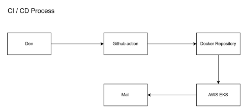
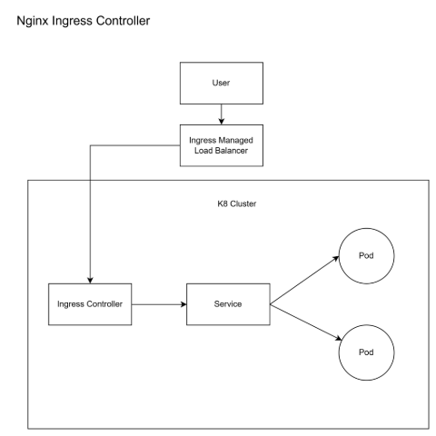
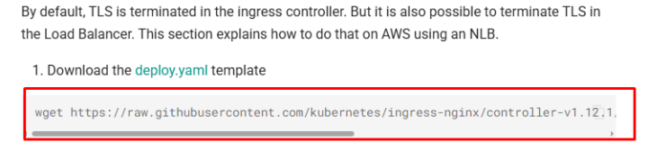
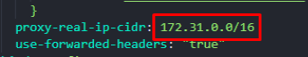
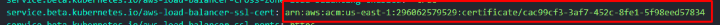
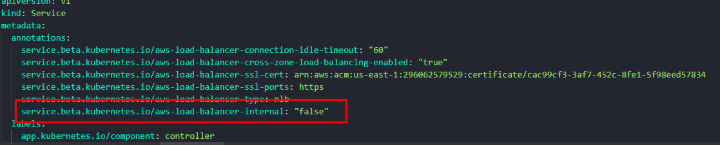

# <a name="_k0w606y8g68p"></a>**Containerization and Deployment of Wisecow Application on Kubernetes**
## <a name="_apj8cxtpwxpf"></a>**Objective:**
The goal of this project is to containerize the Wisecow application and deploy it on a Kubernetes cluster, ensuring secure TLS communication and automating the CI/CD pipeline.
## <a name="_tu3uk6chgryv"></a>**Project Overview:**
The Wisecow application runs the Cowsay and Fortune-mod programs via shell script in the browser. The project involves the following:

- **Dockerizing** the Wisecow application.
- **Deploying** the application to a Kubernetes environment.
- **Securing** communication with TLS.
- Implementing a **CI/CD pipeline** for automated deployment.
## <a name="_d9w1242wryqe"></a>**Key Technologies Used:**
- **Docker**: For containerizing the Wisecow application.
- **Kubernetes (AWS EKS)**: For deploying and managing the application in a scalable environment on AWS.
- **GitHub Actions**: For automating the CI/CD pipeline.
- **AWS Route 53**: For managing DNS records and routing traffic to the Load Balancer.
- **TLS**: For encrypting communications between the client and server.
- **NGINX Ingress Controller**: For routing external traffic to the application.
- **Certificate Manager**: For SSL Certification creation

## <a name="_enasb1u4bkn4"></a><a name="_emt1k2a3ze0"></a><a name="_wal6mzsi0roc"></a><a name="_4psj0e8e9uu7"></a><a name="_mki92kj6svs"></a>**Diagram**



## 
## <a name="_lusofwd4n2ru"></a><a name="_trylnu90tl2u"></a>**Project Components:**
### <a name="_bo5tkp6mb10x"></a>**1. Dockerization:**
To containerize the Wisecow application, the following steps were completed:

- **Dockerfile**: A Dockerfile was created to build the container image of the application.

  FROM ubuntu

  WORKDIR /app

  RUN apt update && apt install -y fortune-mod cowsay netcat-openbsd

  ENV PATH="/usr/games:${PATH}"

  COPY wisecow.sh .

  EXPOSE 4499

  RUN chmod +x wisecow.sh

  CMD ["./wisecow.sh"]

### <a name="_76qxo1zwkh5"></a>**2. Kubernetes Deployment:**
For deploying the Wisecow application on Kubernetes:

- **Deployment Manifest**: Kubernetes YAML manifests were created to deploy the Wisecow application in the Kubernetes environment.
- **Service Exposure**: The application is exposed as a Kubernetes service, making it accessible within the cluster.

**Sample Kubernetes Service Manifest:**

```yaml
apiVersion: v1
kind: Service
metadata:
  name: wisecow-service-deployment
  namespace: wise-deploy
spec:
  selector:
    app: wisecow
  ports:
    - protocol: TCP
      port: 80
      targetPort: 4499
  type: ClusterIP```

### <a name="_30qitufdhkv"></a>**3. Ingress Setup:**
To route external traffic to the Wisecow application, an Ingress was set up. The Ingress provides HTTP(S) routing to the service inside the Kubernetes cluster.

**Sample Ingress Manifest:**

```yaml
apiVersion: networking.k8s.io/v1
kind: Ingress
metadata:
  name: ingress-myservicea
  namespace: wise-deploy
spec:
  rules:
  - host: sriramdevopsengineer.site
    http:
      paths:
      - path: /
        pathType: Prefix
        backend:
          service:
            name: wisecow-service-deployment
            port:
              number: 80
  ingressClassName: nginx

**Node Ingress Setup:**

1. Download the nginx, Go this link - [https://kubernetes.github.io/ingress-nginx/deploy/#aw](https://kubernetes.github.io/ingress-nginx/deploy/#aws)



2. Download the deploy.yaml file and open it

3. Add the vpc cidr block in the proxy-real-ip-cidr



4. Add the service.beta.kubernetes.io/aws-load-balancer-ssl-cert



5. Add the text to make the load balancer internet facing: service.beta.kubernetes.io/aws-load-balancer-internal: "false"



### <a name="_beqrhv5355rh"></a>**4. CI/CD Pipeline:**
To automate the process of building and deploying the application:

- **GitHub Actions** was used to set up a Continuous Integration and Continuous Deployment (CI/CD) pipeline.
- **Automated Image Build and Push**: The pipeline automatically builds the Docker image and pushes it to a container registry whenever changes are made to the repository.
- **Automated Deployment**: Once the image is pushed, the application is automatically deployed to the Kubernetes environment.
### <a name="_ls9va8aur1p2"></a>**GitHub Actions Workflow (main.yml)**
```yaml
name: Workflow to deploy cowsay app to Kubernetes

on:
  push:
    branches:
      - main

jobs:
  deploy_kubernetes:
    runs-on: ubuntu-latest

    env:
      AWS_ACCESS_KEY_ID: ${{ secrets.AWS_ACCESS_KEY_ID }}
      AWS_SECRET_ACCESS_KEY: ${{ secrets.AWS_SECRET_ACCESS_KEY }}

    steps:
    - name: Git checkout
      uses: actions/checkout@v4 

    - name: Setup AWS CLI
      run: |
        sudo apt-get update -y
        curl "https://awscli.amazonaws.com/awscli-exe-linux-x86_64.zip" -o "awscliv2.zip"
        sudo apt-get install unzip -y
        unzip awscliv2.zip
        sudo ./aws/install --update

    - name: Configure Docker
      uses: docker/setup-buildx-action@v3

    - name: Push Docker image to Docker repository
      run: |
        docker build -t sriramravi477/cowsay:${{ github.run_id }} .
        docker login -u ${{ secrets.USERNAME }} -p ${{ secrets.PASSWORD }}
        docker push sriramravi477/cowsay:${{ github.run_id }}

    - name: Setup Kubernetes
      run: |
        curl -LO "https://dl.k8s.io/release/$(curl -L -s https://dl.k8s.io/release/stable.txt)/bin/linux/amd64/kubectl"
        sudo install -o root -g root -m 0755 kubectl /usr/local/bin/kubectl
        chmod +x kubectl
        mkdir -p ~/.local/bin
        mv ./kubectl ~/.local/bin/kubectl

    - name: Update kubectl configuration
      run: |
        aws eks update-kubeconfig --region ${{ secrets.REGION }} --name ${{ secrets.CLUSTER_NAME }}

    - name: Deploy to Kubernetes
      run: |
        kubectl apply -f ./manifest/

    - name: Update image
      run: |
        kubectl set image deployment/wisecow-deployment wisecow-image=sriramravi477/cowsay:${{ github.run_id }}
        kubectl rollout status deployment/wisecow-deployment

### <a name="_yq56es57t4x7"></a>**GitHub Secrets:**
For the workflow to function correctly, you'll need to store the following secrets in your GitHub repository:

- **DOCKER\_USERNAME**: Your Docker Hub username.
- **DOCKER\_PASSWORD**: Your Docker Hub password.
- **KUBECONFIG**: The kubeconfig file content (for Kubernetes cluster access).
- **AWS\_ACCESS\_KEY\_ID**: Your Aws Access Key Id
- **AWS\_SECRET\_ACCESS\_KEY**: Your Aws Secret Key Id

### <a name="_zxom51rr3q0"></a>**How to Add GitHub Secrets:**
1. Go to your GitHub repository.
1. Navigate to **Settings > Secrets and Variables > Actions > Repository secrets**.
1. Add your secrets there (e.g., DOCKER\_USERNAME, DOCKER\_PASSWORD, AWS\_ACCESS\_KEY\_ID, AWS\_SECRET\_ACCESS\_KEY and KUBECONFIG)
### <a name="_cb7t0xu1om4v"></a>**5. TLS Communication:**
The Wisecow application was configured to support secure TLS communication. This ensures that all data transmitted between the client and the application is encrypted, preventing unauthorized access and ensuring privacy.
## <a name="_z3dxl2jhdfzt"></a>**How It Works:**
- The **Wisecow application** is containerized using Docker.
- A Kubernetes **deployment** is created to manage the application on the cluster.
- The application is exposed using a **Kubernetes service**, which allows internal communication within the cluster.
- External access to the application is managed through an **Ingress**, which routes traffic to the service based on the requested domain ([sriramdevopsengineer.site](https://sriramdevopsengineer.site/)).
- The application is configured to support **TLS** for secure communication.
## <a name="_d7mrbfg1bofn"></a>**Benefits of This Approach:**
- **Scalability**: Kubernetes ensures that the application can scale easily to handle increased traffic.
- **Security**: TLS ensures that communication with the application is secure.
- **Automation**: The CI/CD pipeline automates the build and deployment process, reducing manual effort and ensuring faster delivery of updates.
- **Flexibility**: The Ingress allows routing traffic based on domain and path, making it easy to manage multiple services under the same domain.

## <a name="_hnsxaun6nxyc"></a>**Conclusion:**
The Wisecow application is now successfully containerized, deployed on Kubernetes, and exposed securely with TLS communication. The CI/CD pipeline ensures that future updates are automatically built and deployed, streamlining the development process.
